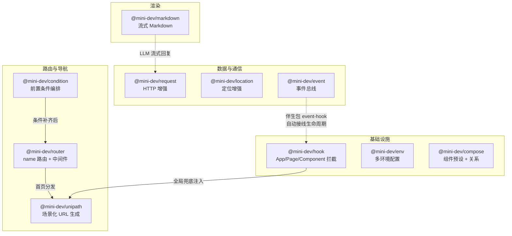

# @mini-dev

> 面向**原生小程序开发**的开源工具箱。不换框架，只补空缺。

`@mini-dev` 是一组专为微信 / 支付宝 / 抖音**原生小程序**设计的工具库。每个成员只解决一件事，独立发布、独立维护、自由组合。如果你坚持用原生小程序开发、不想被 Taro / uni-app 等框架接管生命周期，这就是为你准备的。

---

## 目录

- [1. 这是什么](#1-这是什么)
- [2. 设计哲学](#2-设计哲学)
- [3. 包总览](#3-包总览)
  - [3.1 core —— 工具库](#31-core--工具库)
  - [3.2 CLI 工具](#32-cli-工具)
- [4. 包间关系](#4-包间关系)
- [5. 快速上手](#5-快速上手)
- [6. 状态总览](#6-状态总览)
- [7. License](#7-license)

---

## 1. 这是什么

原生小程序开发中，每个团队都在重复造轮子：手搓环境判断、手写路由跳转、手工管理页面条件检查、自己封装 `request` 拦截器……市面上的轮子要么只支持微信单端，要么依赖框架生态（Taro / uni-app），要么停更已久。

`@mini-dev` 要做的是：**在原生小程序和框架之间，给你第三个选择**——一套体系化、带类型、带测试门槛、跨 wx / my / tt 的工具库。不改变原生 API 语义，不接管生命周期，只在需要的地方叠加增强能力。开箱即用，按需组合。

| 你是… | @mini-dev 适合你吗 |
|-------|-----------------|
| 坚持微信原生开发、不上框架 | ✅ 这就是为你准备的 |
| 跨微信 / 支付宝 / 抖音原生多端 | ✅ 平台拆包 + 跨端核心，正好缺这一层 |
| 已上 Taro / uni-app | ⚠️ 框架已内置大部分能力，通常不需要 |

---

## 2. 设计哲学

以下原则贯穿整个工具箱，解释了绝大多数 API 决策：

| 原则 | 说明 |
|------|------|
| **每个库只解决一件事** | 一个库一个职责。不膨胀、不捆绑，按需组合 |
| **增强，不归一** | 包装库原样透传原生入参、响应、错误，只在其上叠加能力（缓存、重试、超时、参数序列化…）。**不抹平平台差异，不在运行时探测平台** |
| **平台拆包** | 需要触碰 `wx` / `my` / `tt` 全局的库，按平台拆成独立单入口包（`-wx` / `-my` / `-tt`），每个包各自 re-export 平台无关的 core |
| **核心不接管生命周期** | 工具库只提供机制（「做什么」），不决定「什么时候做」。生命周期接线（如页面 `onShow` / `onHide`）拆为可选伴生包，由使用方按需接入 |
| **零依赖优先** | 纯逻辑库零运行时依赖；需要中间件管道的库仅依赖 `koa-compose`；核心不引入构建步骤则直接发布源码 |

---

## 3. 包总览

### 3.1 core —— 工具库

> 各包独立发布到 npm，源码分布在独立 git 仓库（见各包「仓库」列）。

#### 基础设施层

| 包 | 版本 | 一句话职责 | 仓库 |
|----|------|-----------|------|
| [`@mini-dev/hook`](https://www.npmjs.com/package/@mini-dev/hook) |  | 拦截 / 增强 `App`、`Page`、`Component` 的 Option 方法——一次配置，全局兜底 | [xesam/minidev-hook](https://github.com/xesam/minidev-hook) |
| [`@mini-dev/env`](https://www.npmjs.com/package/@mini-dev/env) |  | 按 `envVersion` 区分 develop / trial / release 多环境参数 | [xesam/minidev-env](https://github.com/xesam/minidev-env) |
| [`@mini-dev/compose`](https://www.npmjs.com/package/@mini-dev/compose) |  | 组件复用：`presets` 预设构造器 + `relations` 组件间关系，在 `Behavior` 之上组合 | [xesam/minidev-compose](https://github.com/xesam/minidev-compose) |

#### 路由与导航层

| 包 | 版本 | 一句话职责 | 仓库 |
|----|------|-----------|------|
| [`@mini-dev/router`](https://www.npmjs.com/package/@mini-dev/router) |  | name 映射 + 参数序列化 + 嵌套路由 + koa-compose 洋葱中间件，薄封装原生导航 API | [xesam/minidev-router](https://github.com/xesam/minidev-router) |
| [`@mini-dev/unipath`](https://www.npmjs.com/package/@mini-dev/unipath) |  | 根据 `(name, params)` 生成场景化统一 URL（分享 / push / 深链接），解耦页面路径 | [xesam/minidev-unipath](https://github.com/xesam/minidev-unipath) |
| [`@mini-dev/condition`](https://www.npmjs.com/package/@mini-dev/condition) |  | 前置条件编排引擎——声明页面需要哪些条件，运行时自动判断、串行补齐 | [xesam/minidev-condition](https://github.com/xesam/minidev-condition) |

#### 数据与通信层

| 包 | 版本 | 一句话职责 | 仓库 |
|----|------|-----------|------|
| [`@mini-dev/request`](https://www.npmjs.com/package/@mini-dev/request) |  | 跨端 HTTP 请求库：Promise 化 + 两段式拦截器 + 取消 / 超时 / 重试 / 缓存 / chunked 流式。平台包：[`-wx`](https://www.npmjs.com/package/@mini-dev/request-wx) / [`-my`](https://www.npmjs.com/package/@mini-dev/request-my) / [`-tt`](https://www.npmjs.com/package/@mini-dev/request-tt) | [xesam/minidev-request](https://github.com/xesam/minidev-request) |
| [`@mini-dev/location`](https://www.npmjs.com/package/@mini-dev/location) |  | 跨端设备定位库：缓存 / 超时 / 重试 / 取消 + 自定义拦截器。平台包：[`-wx`](https://www.npmjs.com/package/@mini-dev/location-wx) / [`-my`](https://www.npmjs.com/package/@mini-dev/location-my) / [`-tt`](https://www.npmjs.com/package/@mini-dev/location-tt) | [xesam/minidev-location](https://github.com/xesam/minidev-location) |
| [`@mini-dev/event`](https://www.npmjs.com/package/@mini-dev/event) |  | 生命周期感知事件总线：按页面活跃态挂起 / 补投，补原生跨页通信空缺。伴生包 [`@mini-dev/event-hook`](https://www.npmjs.com/package/@mini-dev/event-hook) 自动接线生命周期 | [xesam/minidev-event](https://github.com/xesam/minidev-event) |

#### 渲染层

| 包 | 版本 | 一句话职责 | 仓库 |
|----|------|-----------|------|
| [`@mini-dev/markdown-core`](https://www.npmjs.com/package/@mini-dev/markdown-core) |  | 小程序 Markdown 渲染引擎（LLM 流式优先）：块级密封 + Patch Diff + 局部 `setData`，增量解析与渲染 | [xesam/minidev-markdown](https://github.com/xesam/minidev-markdown) |

> `markdown` 是 monorepo，除 core 外还发布 5 个支持包：
>
> | 包 | 说明 |
> |----|------|
> | [`@mini-dev/markdown-adapter-wechat`](https://www.npmjs.com/package/@mini-dev/markdown-adapter-wechat) | 微信小程序适配器（`rich-text` 节点树 + 组件段） |
> | [`@mini-dev/markdown-highlight`](https://www.npmjs.com/package/@mini-dev/markdown-highlight) | Prism 代码高亮（fenced code → 彩色 inline span） |
> | [`@mini-dev/markdown-math`](https://www.npmjs.com/package/@mini-dev/markdown-math) | 数学公式轻插件（math/inlineMath 节点 → 组件段） |
> | [`@mini-dev/markdown-math-render`](https://www.npmjs.com/package/@mini-dev/markdown-math-render) | MathJax TeX → SVG 重渲染包（分包按需加载） |
> | [`@mini-dev/markdown-mermaid`](https://www.npmjs.com/package/@mini-dev/markdown-mermaid) | Mermaid 图渲染支持包 |

### 3.2 CLI 工具

| 包 | 版本 | 一句话职责 | 仓库 |
|----|------|-----------|------|
| [`minidev-buildconfig-cli`](https://www.npmjs.com/package/minidev-buildconfig-cli) |  | 多环境配置生成工具：源配置经 CLI 生成运行时配置（Generated Config 模式），避免手写 `dev.js` / `release.js` 手动替换 | [xesam/minidev-buildconfig-cli](https://github.com/xesam/minidev-buildconfig-cli) |

---

## 4. 包间关系



**关键协作关系说明：**

| 关系 | 说明 |
|------|------|
| `router` ↔ `condition` | 正交两个维度：路由决定「去哪里」，condition 决定「去之前先满足什么」 |
| `hook` ↔ `unipath` | hook 全局兜底为每个页面注入分享，unipath 生成统一格式分享链接 |
| `hook` ↔ `event-hook` | event-hook 是 event 的伴生包，通过 hook 的 decoration 协议接线生命周期，零猴补丁 |
| `request` ↔ `markdown` | markdown 渲染 LLM 流式输出时，request 的 `enableChunked` 提供分块数据源 |
| `unipath` ↔ `router` | unipath 生成带 `name` 的入口 URL 落首页，首页用 router 的 name 路由分发到目标页 |

---

## 5. 快速上手

### 5.1 安装

每个包独立安装，按需引入：

```bash
# 基础设施
npm install @mini-dev/hook @mini-dev/env @mini-dev/compose

# 路由与导航
npm install @mini-dev/router @mini-dev/unipath @mini-dev/condition

# HTTP 请求（按平台选一个）
npm install @mini-dev/request-wx    # 微信
npm install @mini-dev/request-my    # 支付宝
npm install @mini-dev/request-tt    # 抖音

# 设备定位（按平台选一个）
npm install @mini-dev/location-wx   # 微信
npm install @mini-dev/location-my   # 支付宝
npm install @mini-dev/location-tt   # 抖音

# 事件总线
npm install @mini-dev/event @mini-dev/event-hook

# Markdown 渲染
npm install @mini-dev/markdown-core @mini-dev/markdown-adapter-wechat
```

### 5.2 构建 npm

小程序使用 npm 包必须经过**构建 npm**：

- **微信**：开发者工具 → 工具 → 构建 npm
- **支付宝**：IDE → 同步小程序
- **抖音**：IDE → 同步 npm 包

构建完成后会生成 `miniprogram_npm` 目录，即可 `require()` / `import` 正常使用。

### 5.3 一个典型组合示例

以「全局 hook + 分享链接 + name 路由」为例：

```text
用户点击分享 → hook 全局注入 onShareAppMessage
             → unipath 生成 /pages/index/index?to=detail&type=share&id=123
             → 其他人打开链接，冷启动落首页
             → 首页 onLoad 识别 type=share
             → router.navigateTo({ name: 'detail' }) 跳转目标页
```

---

## 6. 状态总览

| 包 | npm 状态 | 平台支持 | 仓库类型 |
|----|---------|---------|---------|
| `@mini-dev/hook` |  | 微信 / 支付宝 / 抖音 | 构建型单包（tsup） |
| `@mini-dev/env` |  | 微信 | 源码直发（jest） |
| `@mini-dev/compose` |  | 微信 | 源码直发（jest） |
| `@mini-dev/router` |  | 微信 / 支付宝 / 抖音 / 百度 / QQ | 源码直发（jest, 90% 覆盖率门禁） |
| `@mini-dev/unipath` |  | 平台无关 | 构建型单包（tsdown） |
| `@mini-dev/condition` |  | 平台无关 | pnpm monorepo（1 包） |
| `@mini-dev/event` |  | 平台无关（核心不碰全局） | pnpm monorepo（2 包） |
| `@mini-dev/request` |  | 微信 / 支付宝 / 抖音 | pnpm monorepo（core + 3 平台包） |
| `@mini-dev/location` |  | 微信 / 支付宝 / 抖音 | pnpm monorepo（core + 3 平台包） |
| `@mini-dev/markdown` |  | 微信（当前）/ 支付宝 / 抖音（adapter 待补） | pnpm monorepo（6 包） |

---

## 7. License

MIT
